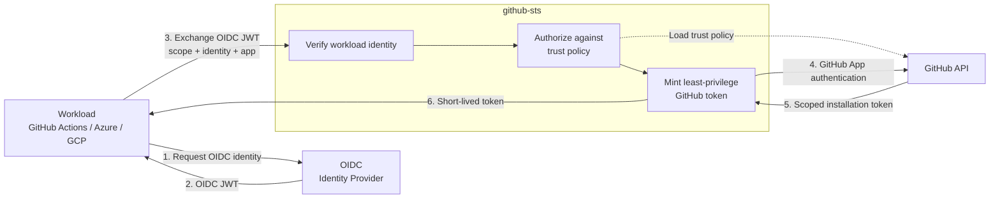

<p align="center">
  
</p>

<p align="center">
  <strong>Exchange OIDC tokens for short-lived, scoped GitHub installation tokens. No PATs. No long-lived secrets.</strong>
</p>

<p align="center">
  <a href="https://github.com/Depthmark/github-sts/blob/main/LICENSE"></a>
  <a href="https://pkg.go.dev/github.com/depthmark/github-sts"></a>
  <a href="https://scorecard.dev/viewer/?uri=github.com/Depthmark/github-sts"></a>
  <a href="https://depthmark.github.io/github-sts/"></a>
</p>

---

## Quick Start

There is no published github-sts image yet, so this builds one locally from the repo's
`Dockerfile`. You need a [GitHub App](https://docs.github.com/en/apps/creating-github-apps) with
its App ID and private key.

```bash
export GITHUBSTS_APP_DEFAULT_APP_ID="123456"
export GITHUBSTS_APP_DEFAULT_PRIVATE_KEY="$(cat /path/to/private-key.pem)"
export GITHUBSTS_OIDC_ALLOWED_ISSUERS="https://token.actions.githubusercontent.com"

docker build -t github-sts:local .
docker run -d --name github-sts-local -p 8080:8080 \
  -e GITHUBSTS_APP_DEFAULT_APP_ID \
  -e GITHUBSTS_APP_DEFAULT_PRIVATE_KEY \
  -e GITHUBSTS_OIDC_ALLOWED_ISSUERS \
  github-sts:local

curl -s http://localhost:8080/health   # {"status":"ok"}
```

For the full walkthrough, including installing the App, writing a trust policy, and exchanging a
real token, start at [Get Started](https://depthmark.github.io/github-sts/get-started/).

## The problem

Giving a CI workflow a GitHub token usually means a long-lived personal access token or a broadly
scoped GitHub App key sitting in a secret store: valid indefinitely, often scoped wider than any
single job needs, and a standing target if leaked.

## What it does

github-sts lets a workload with an OIDC identity (GitHub Actions, Azure, GCP, or any OIDC issuer)
trade that identity for a GitHub installation token scoped to exactly the repositories and
permissions a trust policy allows, valid for one hour. Nothing is stored between requests.


```mermaid
flowchart LR
    W["Workload<br/>GitHub Actions / Azure / GCP"]
    IDP["OIDC<br/>Identity Provider"]

    subgraph STS["github-sts"]
        V["Verify workload identity"]
        A["Authorize against<br/>trust policy"]
        M["Mint least-privilege<br/>GitHub token"]
        V --> A --> M
    end

    GH["GitHub API"]

    W -- "1. Request OIDC identity" --> IDP
    IDP -- "2. OIDC JWT" --> W
    W -- "3. Exchange OIDC JWT<br/>scope + identity + app" --> V
    A -. "Load trust policy" .-> GH
    M -- "4. GitHub App authentication" --> GH
    GH -- "5. Scoped installation token" --> M
    M -- "6. Short-lived token" --> W
```

- **Zero-trust:** identity verified via OIDC JWT validation, no stored credentials
- **Least-privilege:** YAML trust policies define exact permissions per workload identity
- **Multi-app:** route different workloads through different GitHub Apps
- **Replay-safe:** in-memory or Redis-backed JTI tracking

Inspired by [octo-sts/app](https://github.com/octo-sts/app), which pioneered OIDC federation for
GitHub token exchange.

## Documentation

The full site is at **[depthmark.github.io/github-sts](https://depthmark.github.io/github-sts/)**
(English and French):

| Section | Covers |
|---|---|
| [Get Started](https://depthmark.github.io/github-sts/get-started/) | Configure a GitHub App, install it, generate a token, monitor usage |
| [Concepts](https://depthmark.github.io/github-sts/concepts/) | Architecture, security model, trust policies, policy recipes |
| [Integrations](https://depthmark.github.io/github-sts/integrations/) | GitHub Action, Helm chart, end-to-end Kubernetes walkthrough, monitoring |
| [OIDC Issuers](https://depthmark.github.io/github-sts/oidc-issuers/) | Per-provider JWKS/audience setup |
| [Operations](https://depthmark.github.io/github-sts/operations/) | Kubernetes behavior, upgrades, troubleshooting |
| [Reference](https://depthmark.github.io/github-sts/reference/) | API, configuration, environment variables, metrics |
| [Resources](https://depthmark.github.io/github-sts/resources/) | Changelog, contributing guidelines, [vulnerability reporting](https://depthmark.github.io/github-sts/resources/security/) |

## Development

```bash
make build       # go build ./...
make test-race   # go test -race ./...
make lint        # golangci-lint run ./...
make docker      # docker build -t github-sts:local .
make act         # run CI locally with act
make hooks       # enable the repo's versioned pre-commit hooks
```

## Contributing

Contributions are welcome, particularly around security hardening, policy evaluation, and new
identity provider integrations. Open an issue or a PR.

## License

[MIT License](LICENSE). Copyright (c) 2026 Alexandre Delisle

## Acknowledgments

- [octo-sts/app](https://github.com/octo-sts/app): the original Go implementation that pioneered OIDC-to-GitHub token exchange
- [GitHub OIDC Documentation](https://docs.github.com/en/actions/deployment/security-hardening-your-deployments/about-security-hardening-with-openid-connect)
- [OpenID Connect Specification](https://openid.net/connect/)
