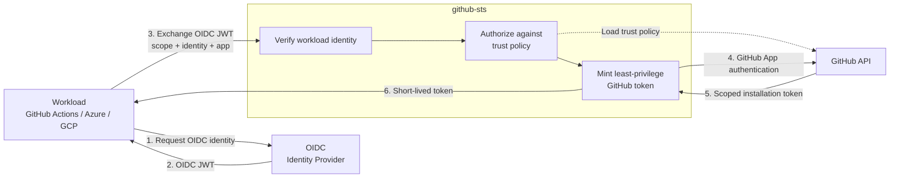

<p align="center">
  
</p>

<p align="center">
  <strong>Exchange OIDC tokens for short-lived, scoped GitHub installation tokens. No PATs. No long-lived secrets.</strong>
</p>

<p align="center">
  <a href="https://github.com/Depthmark/github-sts/releases"></a>
  <a href="https://github.com/Depthmark/github-sts/blob/main/LICENSE"></a>
  <a href="https://pkg.go.dev/github.com/depthmark/github-sts"></a>
  <a href="https://github.com/Depthmark/github-sts/actions"></a>
  <a href="https://depthmark.github.io/github-sts/"></a>
</p>

---

Workloads with OIDC tokens (GitHub Actions, Azure, GCP, any IdP) present their identity and receive a **least-privilege GitHub token** scoped to exactly the repositories and permissions they need. Supports **multiple GitHub Apps** with YAML-based configuration, making it ideal for Kubernetes ConfigMaps.

Inspired by [octo-sts/app](https://github.com/octo-sts/app), which pioneered OIDC federation for GitHub token exchange.

## Highlights

| | Feature | Description |
|---|---|---|
| **Zero-trust** | OIDC Federation | No stored credentials; identity verified via OIDC JWT validation |
| **Least-privilege** | Policy-based Scoping | YAML trust policies define exact permissions per workload identity |
| **Multi-app** | Multiple GitHub Apps | Route different workloads through different GitHub Apps |
| **Org-scope** | Organization Tokens | Issue tokens scoped to an entire org or a subset of repositories |
| **Observable** | Prometheus Metrics | Built-in metrics and structured audit logging |
| **Replay-safe** | JTI Cache | Memory or Redis-backed JTI tracking prevents token replay attacks |
| **Portable** | Distroless Container | Single static binary in a minimal container; runs anywhere |

## Table of Contents

- [Architecture](#architecture)
- [Quick Start](#quick-start)
- [Usage](#usage)
  - [Go Client Library](#go-client-library)
- [Trust Policies](#trust-policies)
  - [Policy Schema](#policy-schema)
  - [Policy Examples](#policy-examples)
  - [Organization-Level Scope](#organization-level-scope)
- [Configuration](#configuration)
  - [YAML Configuration](#yaml-configuration)
  - [Environment Variables](#environment-variables)
- [API Reference](#api-reference)
  - [Token Exchange](#token-exchange)
  - [Token Revocation](#token-revocation)
  - [Health & Readiness](#health--readiness)
- [Deployment](#deployment)
  - [Docker](#docker)
  - [Helm / Kubernetes](#helm--kubernetes)
- [Observability](#observability)
- [Development](#development)
- [Troubleshooting](#troubleshooting)
- [Contributing](#contributing)
- [License](#license)

## Architecture


```mermaid
flowchart LR
    W["Workload<br/>GitHub Actions / Azure / GCP"]

    IDP["OIDC<br/>Identity Provider"]

    subgraph STS["github-sts"]
        V["Verify workload identity"]
        A["Authorize against<br/>trust policy"]
        M["Mint least-privilege<br/>GitHub token"]
        V --> A --> M
    end

    GH["GitHub API"]

    W -- "1. Request OIDC identity" --> IDP
    IDP -- "2. OIDC JWT" --> W

    W -- "3. Exchange OIDC JWT<br/>scope + identity + app" --> V

    A -. "Load trust policy" .-> GH

    M -- "4. GitHub App authentication" --> GH
    GH -- "5. Scoped installation token" --> M

    M -- "6. Short-lived token" --> W
```

**OIDC proves who the workload is → policy determines what it may do → GitHub issues the credential.**

### How It Works

1. A workload requests an OIDC token from its identity provider
2. The workload presents the OIDC JWT to `/sts/exchange` with `scope`, `identity`, and `app`
3. github-sts validates the OIDC token (issuer, signature, expiry, audience, replay) and resolves the trust policy
4. If the policy authorizes the workload, github-sts authenticates as the GitHub App and mints a scoped installation token
5. The short-lived, least-privilege token is returned to the workload

### Project Structure

```
cmd/github-sts/           Entry point — server bootstrap, signal handling
client/                   Importable Go client library (token exchange + revocation)
internal/
  config/                 YAML + env var configuration
  audit/                  Channel-based async audit logger
  handler/                HTTP handlers (exchange, health, readiness)
  server/                 HTTP server lifecycle, middleware, graceful shutdown
  metrics/                Prometheus metrics registry
  oidc/                   OIDC JWT validation with JWKS caching
  policy/                 Trust policy loading & claim evaluation
  jti/                    JTI replay cache (in-memory + Redis)
  github/                 GitHub App auth, installation token provider
config/examples/          Ready-to-use trust policy templates
```

## Quick Start

### Prerequisites

- **Go 1.26+** (local development) or **Docker** (container builds)
- A [GitHub App](https://docs.github.com/en/apps/creating-github-apps) with the permissions you want to delegate

### 1. Configure credentials

```bash
# Option A: Environment variables
export GITHUBSTS_APP_DEFAULT_APP_ID="123456"
export GITHUBSTS_APP_DEFAULT_PRIVATE_KEY="$(cat /path/to/private-key.pem)"

# Option B: YAML config file (see config/github-sts.example.yaml)
export GITHUBSTS_CONFIG_PATH=./config/github-sts.example.yaml
```

### 2. Run

<table>
<tr><th>Go</th><th>Docker</th></tr>
<tr>
<td>

```bash
go build -o github-sts ./cmd/github-sts
./github-sts
```

</td>
<td>

```bash
docker build -t github-sts:local .
docker run -p 8080:8080 \
  -e GITHUBSTS_APP_DEFAULT_APP_ID \
  -e GITHUBSTS_APP_DEFAULT_PRIVATE_KEY \
  github-sts:local
```

</td>
</tr>
</table>

### 3. Verify

```bash
curl http://localhost:8080/health   # {"status":"ok"}
curl http://localhost:8080/ready    # {"status":"ready"}
```

### 4. Exchange a token

```bash
curl -H "Authorization: Bearer $OIDC_TOKEN" \
  "http://localhost:8080/sts/exchange?scope=org/repo&app=default&identity=ci"
```

## Usage

### Go Client Library

```go
import "github.com/depthmark/github-sts/client"

// Direct GitHub App token (requires the App private key)
provider, err := client.NewAppTokenProvider(appID, pemData, "myorg", "https://api.github.com")
if err != nil { /* handle */ }
token, err := provider.Token(ctx)

// STS token exchange (requires an OIDC token and the STS URL)
stsProvider := &client.STSTokenProvider{
    STSURL:     "https://sts.example.com",
    Identity:   "ci",
    Scope:      "myorg/myrepo",
    App:        "default",
    Audience:   "https://sts.example.com",
    SATokenPath: client.DefaultSATokenPath,
}
token, err = stsProvider.Token(ctx)

// Token revocation
err = client.RevokeToken(ctx, token, "https://api.github.com")
```

## Trust Policies

Trust policies are YAML files stored **in the target repository** that define which OIDC identities can request tokens and with what permissions.

**Location:** `.github/sts/{app_name}/{identity}.sts.yaml`

For example, `app=my-app` and `identity=ci` resolves to:
`.github/sts/my-app/ci.sts.yaml`

### Policy Schema

| Field | Type | Description |
|---|---|---|
| `issuer` | `string` | OIDC `iss` claim (exact match) |
| `subject` | `string` | OIDC `sub` claim (exact match) |
| `subject_pattern` | `regex` | OIDC `sub` claim (regex, used when `subject` is absent) |
| `claim_pattern` | `map[string]regex` | Additional JWT claims to match |
| `audience` | `string` | **Required.** Expected OIDC `aud` claim. A policy without it would accept tokens minted for any other relying party sharing the issuer (cross-RP token reuse) and is rejected at parse time. |
| `repositories` | `list[string]` | Present in the schema but not applied in the exchange flow |
| `permissions` | `map[string]string` | GitHub App permissions (`read` / `write` / `admin`) |

### Policy Examples

**Exact match (most secure):**
```yaml
issuer: https://token.actions.githubusercontent.com
subject: repo:org/repo:ref:refs/heads/main
audience: https://sts.example.com
permissions:
  contents: read
  issues: write
```

**Regex patterns (flexible; Azure example):**
```yaml
issuer: https://login.microsoftonline.com/{tenant-id}/v2.0
subject_pattern: "[a-f0-9-]+"
claim_pattern:
  azp: "your-azure-app-client-id"
permissions:
  contents: read
```

**Restrict to specific workflow (least-privilege):**
```yaml
issuer: https://token.actions.githubusercontent.com
subject_pattern: "repo:org/repo:.*"
audience: https://sts.example.com
claim_pattern:
  job_workflow_ref: "org/repo/.github/workflows/deploy\\.yml@.*"
permissions:
  deployments: write
  statuses: write
```

> **`audience` is mandatory.** Every policy must declare the OIDC audience it
> trusts. The same value must be passed to `core.getIDToken(<audience>)` in
> the workflow that requests the token. A missing `audience:` is rejected at
> policy parse time; it would otherwise accept tokens minted for any other
> relying party that shares the issuer (cross-RP token reuse).

### Organization-Level Scope

In addition to repo-level scope (`scope=org/repo`), github-sts supports **org-level scope** (`scope=myorg`). A centralized org-level policy is scoped to the single repository derived from the OIDC `sub` claim; it does not grant org-wide access.

Configure `org_policy_repo` to specify where org-level policies live:

```yaml
# In server config
apps:
  default:
    app_id: 123456
    private_key_path: "/etc/github-sts/keys/default.pem"
    org_policy_repo: ".github"
```

```bash
# Or via environment variable
export GITHUBSTS_APP_DEFAULT_ORG_POLICY_REPO=".github"
```

**Org-level policy example** (placed in `myorg/.github/.github/sts/default/org-ci.sts.yaml`):

```yaml
issuer: https://token.actions.githubusercontent.com
subject_pattern: "repo:myorg/.*"
audience: https://sts.example.com
permissions:
  contents: read
  pull_requests: write
```

#### Resolving identities defined in both repo and org

When the same identity (e.g. `default/ci`) has a policy file in both the
requesting repo and the org policy repo, `policy_resolution` decides which one
wins:

| Mode | Order | On collision | Use when |
|------|-------|--------------|----------|
| `org_first` *(default)* | org → repo fallback | **org wins** | Org admin owns identity names; repos may self-service identities the org has not claimed. |
| `repo_first` *(legacy, deprecated)* | repo → org fallback | repo wins | Backwards-compat only; allows repo owners to override the centralized policy. Emits a deprecation warning at startup. |
| `org_only` | org repo only, no fallback | n/a | Strictly forbid self-service. Repos cannot define their own policies. |

The mode is configured per app:

```yaml
apps:
  default:
    app_id: 123456
    private_key_path: "/etc/github-sts/keys/default.pem"
    org_policy_repo: ".github"
    policy_resolution: org_first   # default; can be "repo_first" or "org_only"
```

```bash
export GITHUBSTS_APP_DEFAULT_POLICY_RESOLUTION="org_first"
```

The `org_first` default treats the org policy repo as a **reservation list**:
any identity name the org admin writes a file for is reserved org-wide;
identities the org has not claimed are delegated to repos. This closes a
historical bypass where a repo owner could shadow a centralized policy by
dropping a permissive file in their own repo.

If `org_policy_repo` is unset, only the requesting repo is consulted regardless
of mode.

## Configuration

github-sts supports YAML configuration files and environment variable overrides.

### YAML Configuration

See [`config/github-sts.example.yaml`](config/github-sts.example.yaml) for a complete example.

```bash
export GITHUBSTS_CONFIG_PATH=/etc/github-sts/config.yaml
```

### Environment Variables

All environment variables use the `GITHUBSTS_` prefix. Per-app variables use `GITHUBSTS_APP_{NAME}_{FIELD}`.

#### Server Settings

| Variable | Default | Description |
|---|---|---|
| `GITHUBSTS_CONFIG_PATH` | &mdash; | Path to YAML config file |
| `GITHUBSTS_SERVER_HOST` | `0.0.0.0` | HTTP listen host |
| `GITHUBSTS_SERVER_PORT` | `8080` | HTTP listen port |
| `GITHUBSTS_SERVER_LOG_LEVEL` | `info` | `debug`, `info`, `warn`, `error` |
| `GITHUBSTS_SERVER_SUPPRESS_HEALTH_LOGS` | `true` | Suppress health endpoint access logs |
| `GITHUBSTS_SERVER_SHUTDOWN_TIMEOUT` | `10s` | Graceful shutdown grace period |
| `GITHUBSTS_SERVER_TRUST_FORWARDED_HEADERS` | `false` | Trust `X-Forwarded-For` for client IP |
| `GITHUBSTS_METRICS_ENABLED` | `true` | Enable Prometheus metrics |

#### GitHub App Settings

| Variable | Default | Description |
|---|---|---|
| `GITHUBSTS_APP_{NAME}_APP_ID` | *required* | GitHub App numeric ID |
| `GITHUBSTS_APP_{NAME}_PRIVATE_KEY` | *required* | PEM string (mutually exclusive with `_PATH`) |
| `GITHUBSTS_APP_{NAME}_PRIVATE_KEY_PATH` | &mdash; | Path to PEM file |
| `GITHUBSTS_APP_{NAME}_ORG_POLICY_REPO` | &mdash; | Repo for org-level policies (e.g. `.github`) |
| `GITHUBSTS_APP_{NAME}_POLICY_RESOLUTION` | `org_first` | Resolution mode: `org_first`, `repo_first` (deprecated), or `org_only` |

#### Policy & Security Settings

| Variable | Default | Description |
|---|---|---|
| `GITHUBSTS_POLICY_BASE_PATH` | `.github/sts` | Base path in repos for trust policies |
| `GITHUBSTS_POLICY_CACHE_TTL` | `60s` | Policy cache TTL (`0` to disable) |
| `GITHUBSTS_OIDC_ALLOWED_ISSUERS` | &mdash; | Comma-separated issuer allowlist. Required; an empty list is a validation error. |
| `GITHUBSTS_OIDC_REQUIRED_AUDIENCE` | &mdash; | Server-wide required `aud` claim. When set, every token must carry this value (defense-in-depth on top of the per-policy `audience:` field). |
| `GITHUBSTS_JTI_BACKEND` | `memory` | `memory` or `redis` |
| `GITHUBSTS_JTI_REDIS_URL` | &mdash; | Redis connection URL (when backend=`redis`) |
| `GITHUBSTS_JTI_TTL` | `1h` | JTI replay protection window |

#### Audit Settings

| Variable | Default | Description |
|---|---|---|
| `GITHUBSTS_AUDIT_FILE_ENABLED` | `true` | Enable file-based audit logging |
| `GITHUBSTS_AUDIT_FILE_PATH` | `/var/log/github-sts/audit.json` | Audit log file path |
| `GITHUBSTS_AUDIT_BUFFER_SIZE` | `1024` | Audit channel buffer size |

## API Reference

### Token Exchange

#### `GET /sts/exchange`

Exchange an OIDC bearer token for a scoped GitHub installation token.

| Parameter | Required | Description |
|---|---|---|
| `scope` | Yes | `org/repo` (repo-level) or `org` (org-level) |
| `identity` | Yes | Policy selector; maps to `{base_path}/{app}/{identity}.sts.yaml` |
| `app` | No | App name (defaults to single configured app) |

```bash
curl -H "Authorization: Bearer $OIDC_TOKEN" \
  "http://localhost:8080/sts/exchange?scope=myorg/myrepo&app=default&identity=ci"
```

#### `POST /sts/exchange`

Same endpoint, JSON body variant.

```bash
curl -X POST -H "Authorization: Bearer $OIDC_TOKEN" \
  -H "Content-Type: application/json" \
  -d '{"scope":"myorg/myrepo","app":"default","identity":"ci"}' \
  http://localhost:8080/sts/exchange
```

#### Response

**Success (200):**
```json
{
  "token": "ghs_xxxxxxxxxxxxxxxxxxxx",
  "scope": "myorg/myrepo",
  "app": "default",
  "identity": "ci",
  "permissions": {
    "contents": "read",
    "pull_requests": "write"
  }
}
```

**Errors:**

Error responses share this shape:

```json
{ "error": "forbidden", "code": "policy_denied", "trace_id": "abc-123" }
```

`error` is deliberately generic so attackers can't probe the validator. Use `code` to branch in your client and `trace_id` to correlate with server/audit logs (the log line carries the full reason).

| Status | `code` | What to fix |
|---|---|---|
| `400` | `bad_request` | Missing/invalid query params or JSON body. |
| `403` | `oidc_invalid` | OIDC token rejected (missing/expired, bad signature, unknown `iss`, missing `kid`, malformed). Refresh or re-mint the token; verify `allowed_issuers`. |
| `403` | `audience_mismatch` | Token's `aud` does not match the policy's `audience:`. Pass the right value to `core.getIDToken(<audience>)` or update the policy. |
| `403` | `app_unknown` | `?app=` does not match a configured app. Check spelling or omit when only one app is configured. |
| `403` | `policy_not_found` | No `.sts.yaml` for this `scope/app/identity`. Verify the file path: `{base_path}/{app}/{identity}.sts.yaml` in the target (or org policy) repo. |
| `403` | `policy_denied` | Policy exists but evaluation failed (subject, claim_pattern). Check the audit log line at `trace_id` for the precise mismatch. |
| `405` | `method_not_allowed` | Use `GET` or `POST`. |
| `409` | `replay_detected` | JTI already consumed; obtain a fresh OIDC token. |
| `500` | `internal_error` | Server-side problem (cache backend, app misconfig). Check server logs at `trace_id`. |
| `502` | `upstream_error` | Policy fetch or GitHub token mint failed. Check server logs at `trace_id`. |

### Token Revocation

Tokens issued by github-sts are standard GitHub App installation tokens and can be revoked directly via the GitHub API:

```bash
curl -X DELETE https://api.github.com/installation/token \
  -H "Authorization: Bearer $GITHUB_TOKEN" \
  -H "Accept: application/vnd.github+json"
# 204 = revoked, 401/404 = already expired
```

Or via the Go client:
```go
err := client.RevokeToken(ctx, token, "https://api.github.com")
```

### Health & Readiness

| Endpoint | Method | Success | Failure |
|---|---|---|---|
| `/health` | `GET` | `200` `{"status":"ok"}` | &mdash; |
| `/ready` | `GET` | `200` `{"ready":true}` | `503` `{"ready":false}` |
| `/metrics` | `GET` | Prometheus text format | &mdash; |

## Deployment

### Docker

```bash
# Build
docker build -t github-sts:local .

# Run with config file
docker run -p 8080:8080 \
  -v $(pwd)/config/github-sts.example.yaml:/etc/github-sts/config.yaml:ro \
  -e GITHUBSTS_CONFIG_PATH=/etc/github-sts/config.yaml \
  -e GITHUBSTS_APP_DEFAULT_APP_ID="$GITHUBSTS_APP_DEFAULT_APP_ID" \
  -e GITHUBSTS_APP_DEFAULT_PRIVATE_KEY="$GITHUBSTS_APP_DEFAULT_PRIVATE_KEY" \
  github-sts:local

# Run with env vars only
docker run -p 8080:8080 \
  -e GITHUBSTS_CONFIG_PATH=/dev/null \
  -e GITHUBSTS_APP_DEFAULT_APP_ID="$GITHUBSTS_APP_DEFAULT_APP_ID" \
  -e GITHUBSTS_APP_DEFAULT_PRIVATE_KEY="$GITHUBSTS_APP_DEFAULT_PRIVATE_KEY" \
  -e GITHUBSTS_OIDC_ALLOWED_ISSUERS="https://token.actions.githubusercontent.com" \
  -e GITHUBSTS_OIDC_REQUIRED_AUDIENCE="https://sts.example.com" \
  github-sts:local
```

The image uses [distroless](https://github.com/GoogleContainerTools/distroless) with a nonroot user for a minimal attack surface.

### Helm / Kubernetes

A Helm chart is maintained in a separate repository: [github-sts-helm](https://github.com/Depthmark/github-sts-helm).

See the [github-sts-helm](https://github.com/Depthmark/github-sts-helm) repository for installation instructions, Ingress/HTTPRoute setup, and full configuration options.

## Observability

All metrics are exposed at `GET /metrics` in Prometheus text format with the `githubsts_` prefix.

<details>
<summary><strong>Full metrics reference</strong></summary>

| Metric | Type | Description |
|---|---|---|
| `githubsts_http_requests_total` | Counter | HTTP requests by method, path, status |
| `githubsts_http_request_duration_seconds` | Histogram | HTTP request latency |
| `githubsts_http_requests_in_flight` | Gauge | Concurrent requests |
| `githubsts_token_exchanges_total` | Counter | Exchange attempts by app, scope, identity, result |
| `githubsts_token_exchange_duration_seconds` | Histogram | Exchange latency |
| `githubsts_oidc_validation_errors_total` | Counter | OIDC failures by issuer, reason |
| `githubsts_policy_loads_total` | Counter | Policy loads by app, backend, result |
| `githubsts_policy_cache_hits_total` | Counter | Cache hits by app |
| `githubsts_policy_cache_misses_total` | Counter | Cache misses by app |
| `githubsts_github_api_calls_total` | Counter | GitHub API calls by app, endpoint, result |
| `githubsts_github_tokens_issued_total` | Counter | Tokens issued by app, scope, permissions |
| `githubsts_github_rate_limit_remaining` | Gauge | Remaining rate limit by app, resource |
| `githubsts_github_reachable` | Gauge | GitHub API reachability (1/0) by app |
| `githubsts_jti_replay_attempts_total` | Counter | JTI replay attacks detected |
| `githubsts_audit_events_dropped_total` | Counter | Audit events dropped (full buffer) |
| `githubsts_ready` | Gauge | Instance readiness (1/0) |

</details>

## Development

### Build

```bash
go build -o github-sts ./cmd/github-sts                              # dev build
CGO_ENABLED=0 go build -ldflags="-s -w" -o github-sts ./cmd/github-sts  # production
go vet ./...                                                          # static analysis
golangci-lint run ./...                                               # linting
```

### Test

```bash
go test -race -v ./...                           # all tests
go test -race -coverprofile=coverage.out ./...    # with coverage
go tool cover -html=coverage.out                  # view coverage in browser
go test -race -v ./internal/policy/...            # specific package
go test -race -v -run TestExchange ./internal/handler/...  # specific test
```

### Local CI

Run GitHub Actions workflows locally with [act](https://github.com/nektos/act):

```bash
make act          # all CI jobs
make act-lint     # lint only
make act-test     # test only
make act-build    # build only
```

## Troubleshooting

| Problem | Solution |
|---|---|
| **Docker build fails** with `go.mod requires go >= X` | Update `FROM golang:X-alpine` in `Dockerfile` to match `go.mod` |
| **Health check fails** | Verify `GITHUBSTS_CONFIG_PATH` is set and the file exists |
| **Exchange returns `401`** | Check OIDC token expiry, verify `allowed_issuers` includes the issuer, review server logs |
| **Exchange returns `403`** with `code: "audience_mismatch"` | Token's `aud` does not match. Verify `core.getIDToken(<audience>)` in the workflow uses the same value as the policy's `audience:` field (and `oidc.required_audience` if configured server-side). |
| **Exchange returns `403`** (any other code) | Look at `code` in the response body; it tells you which layer rejected the request (`oidc_invalid`, `app_unknown`, `policy_not_found`, `policy_denied`). Then grep server logs for the `trace_id` returned in the same response for the precise reason. See [Errors](#response) for the full table. |
| **Exchange returns `403`** with `code: "policy_not_found"` | Verify the trust policy exists at `{base_path}/{app}/{identity}.sts.yaml` in the target repo. A wrong file path or a GitHub App that lacks read access to the policy file produces the same error. |
| **Exchange returns `409`** | JTI replay; the OIDC token was already used. Obtain a fresh token |

## Contributing

Contributions are welcome! Areas of interest:

- Security hardening
- Policy evaluation capabilities
- Observability and monitoring
- Documentation improvements
- New identity provider integrations

## License

[MIT License](LICENSE). Copyright (c) 2026 Alexandre Delisle

## Acknowledgments

- [octo-sts/app](https://github.com/octo-sts/app). Original Go implementation that pioneered OIDC-to-GitHub token exchange
- [GitHub OIDC Documentation](https://docs.github.com/en/actions/deployment/security-hardening-your-deployments/about-security-hardening-with-openid-connect)
- [OpenID Connect Specification](https://openid.net/connect/)
- [GitHub App Documentation](https://docs.github.com/en/apps)
