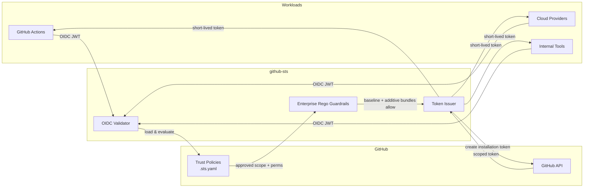

# Architecture

## High-level flow



## How it works

1. A workload presents its **OIDC JWT** to the `/sts/exchange` endpoint.
2. github-sts **validates** the token signature, expiry, and issuer against JWKS (with caching).
3. For GitHub.com Actions, the broker validates canonical source owner/repository names and IDs, including immutable `sub` format by default.
4. The selected GitHub App resolves the exact current target name to canonical owner/repository names and immutable IDs.
5. The **trust policy** stored in the target repo is loaded with an immutable-ID cache key and evaluated against the JWT claims (`iss`, `sub`, `aud`, custom `claim_pattern`s).
6. For GitHub.com, the policy's typed `github.sources[]` and `github.target` must match the exact source and target IDs.
7. The explicit bundle posture is enforced: required mode evaluates the global mandatory baseline and applicable additive bundles; optional mode may intentionally have no bundles and use YAML-only authorization.
8. If approved, github-sts requests a **scoped installation token** using the authorized target `repository_id`, not a mutable repository name.
9. The short-lived token is returned with only the permitted target repository and permissions.

```
Workload ──OIDC JWT──> github-sts ──validates──> loads policy ──approved──> GitHub API
                                                                              │
Workload <──scoped token + permissions──────────────────────────────────────────
```

## Validation pipeline

Every request passes through these checks, in order:

1. **JWT structural validation** — header, signature, `exp`, `nbf`, `iat`.
2. **Issuer allowlist** — `iss` must be in `oidc.allowed_issuers` (if set).
3. **JWKS lookup** — `kid` must match a key from the issuer's discovered JWKS. Hosts outside the issuer's domain require `oidc.trusted_jwks_hosts` opt-in. See [OIDC Issuers](oidc-issuers.md).
4. **Canonical GitHub identity** — for GitHub.com, require signed repository owner/repository IDs, cross-check all repository claims, and require immutable IDs in `sub` by default. Failure returns `github_identity_invalid` before state or target lookup.
5. **Server-wide audience check** — `aud` must match `oidc.required_audience` if configured.
6. **JTI replay check** — token's `jti` must not have been seen within `jti.ttl`. Backed by memory or Redis.
7. **App and target resolution** — select the App, resolve canonical target names and IDs, and reject stale/non-canonical names.
8. **Policy lookup** — load `{base_path}/{app}/{identity}.sts.yaml` from the target repo (or central policy repo, depending on `policy_resolution`) with a cache key containing target IDs.
9. **Policy validation and audience check** — require a workload selector, typed GitHub bindings where applicable, and an exact `audience:` match.
10. **Claim and relationship evaluation** — workload selectors and exact immutable `github.sources[]`/`github.target` IDs must match.
11. **Enterprise Rego enforcement** — required mode proves the mandatory global baseline participated, then composes all applicable app-scoped bundles additively. Optional mode evaluates any configured applicable bundles; only explicit optional/no-bundle mode skips this layer.
12. **Token mint** — call GitHub using one authorized `repository_id`. Organization-level scopes currently fail closed.

A failure returns a stable error `code`. Only an evaluated enterprise deny uses
`403 org_policy_denied`; stale bundles, missing required participation, and
evaluation faults use `503 bundle_stale`, `bundle_unavailable`, and
`bundle_evaluation_failed`, respectively. See
[API Reference: Error responses](api-reference.md#error-responses).

## Bundle admission and participation

Startup requires top-level `bundle_enforcement` to be exactly `required` or
`optional`. Required mode admits exactly one global `apps: []` baseline, and
every required-mode bundle must be digest-pinned OCI and cosign verified. The
global baseline is fail-closed and must expose
`data.sts.enterprise.v1.decision` plus
`data.sts.enterprise.v1.metadata` with the v1 contract metadata. The broker
requires that baseline to deny malformed input, missing identity, unknown
source, and unknown permission probes before installation.

At request time, the global baseline applies to every app. App-scoped bundles
can add denials but cannot replace the baseline. Required mode returns
`bundle_unavailable` unless the baseline actually evaluates. Optional mode with
no bundles is deliberately YAML-only and reports that posture through startup
warning, health, metric, and audit signals.

## Policy resolution

For repo-level scope (`scope=org/repo`), policies can live in two places:

- **Repo-local:** `org/repo/.github/sts/{app}/{identity}.sts.yaml`
- **Org-level:** `org/{org_policy_repo}/.github/sts/{app}/{identity}.sts.yaml`

The `policy_resolution` setting per app decides which wins on collision:

| Mode | Order | On collision |
|------|-------|--------------|
| `org_first` *(default)* | org → repo fallback | **org wins** |
| `repo_first` *(deprecated)* | repo → org fallback | repo wins |
| `org_only` | org repo only, no fallback | n/a |

See [Configuration → Resolving identities defined in both repo and org](configuration.md#resolving-identities-defined-in-both-repo-and-org) for the full rationale.

## Project structure

```
cmd/github-sts/           Entry point — server bootstrap, signal handling
client/                   Importable Go client library (token exchange + revocation)
internal/
  config/                 YAML + env var configuration
  audit/                  Channel-based async audit logger
  handler/                HTTP handlers (exchange, health, readiness)
  server/                 HTTP server lifecycle, middleware, graceful shutdown
  metrics/                Prometheus metrics registry
  oidc/                   OIDC JWT validation with JWKS caching
  policy/                 Trust policy loading & claim evaluation
  bundle/                 OPA bundle loading, verification, evaluation, and lifecycle
  jti/                    JTI replay cache (in-memory + Redis)
  ratelimit/              Per-identity rate limiting
  github/                 GitHub App auth, installation token provider
config/examples/          Ready-to-use trust policy templates
```

## Caching

| Cache | Default TTL | Setting | Purpose |
|---|---|---|---|
| JWKS keys | issuer-driven | — | Avoid fetching JWKS on every request |
| Target identity | `5m` | — | Bound GitHub metadata lookups while refreshing canonical names and immutable IDs |
| Trust policy | `60s` | `GITHUBSTS_POLICY_CACHE_TTL` | Avoid re-fetching `.sts.yaml`; repository targets are isolated by immutable IDs |
| Installation token (per app/scope) | minted lifetime | — | Short-lived; effectively single-use per request |
| JTI replay set | `1h` | `GITHUBSTS_JTI_TTL` | Replay window. Use `redis` backend for multi-replica deployments. |

## Multi-replica considerations

- Use `GITHUBSTS_JTI_BACKEND=redis` so JTI replay protection is shared across instances. With `memory`, an attacker who reaches a different replica can replay an OIDC token.
- Trust policy cache is per-instance; instances may briefly serve different policies after a `.sts.yaml` change. Lower `GITHUBSTS_POLICY_CACHE_TTL` if this matters.
- `/ready` returns `503` until GitHub API reachability succeeds; use it for load balancer health checks.
