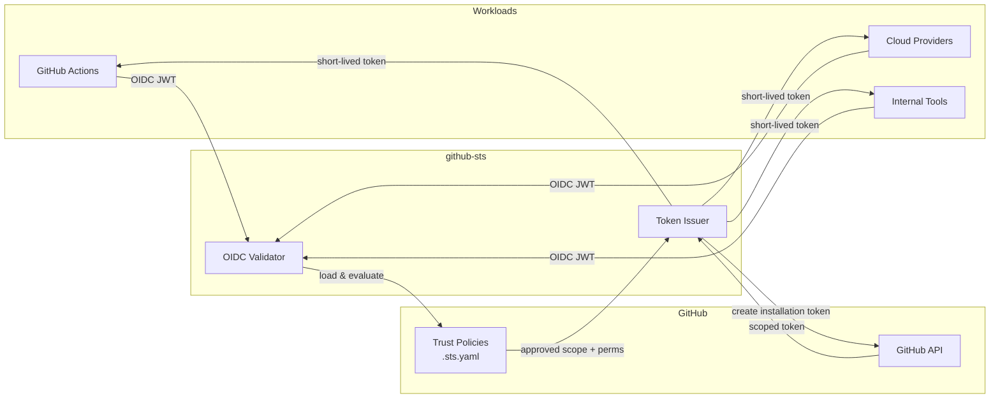

# Architecture

## High-level flow



## How it works

1. A workload presents its **OIDC JWT** to the `/sts/exchange` endpoint.
2. github-sts **validates** the token signature, expiry, and issuer against JWKS (with caching).
3. The **trust policy** stored in the target repo is loaded and evaluated against the JWT claims (`iss`, `sub`, `aud`, custom `claim_pattern`s).
4. If approved, github-sts requests a **scoped installation token** from the GitHub API using the GitHub App's private key.
5. The short-lived token is returned to the workload with only the permitted permissions and (for org-scope) the permitted repositories.

```
Workload ──OIDC JWT──> github-sts ──validates──> loads policy ──approved──> GitHub API
                                                                              │
Workload <──scoped token + permissions──────────────────────────────────────────
```

## Validation pipeline

Every request passes through these checks, in order:

1. **JWT structural validation** — header, signature, `exp`, `nbf`, `iat`.
2. **Issuer allowlist** — `iss` must be in `oidc.allowed_issuers` (if set).
3. **JWKS lookup** — `kid` must match a key from the issuer's discovered JWKS. Hosts outside the issuer's domain require `oidc.trusted_jwks_hosts` opt-in. See [OIDC Issuers](oidc-issuers.md).
4. **Server-wide audience check** — `aud` must match `oidc.required_audience` if configured.
5. **JTI replay check** — token's `jti` must not have been seen within `jti.ttl`. Backed by memory or Redis.
6. **Policy lookup** — load `{base_path}/{app}/{identity}.sts.yaml` from the requested repo (or org policy repo, depending on `policy_resolution`).
7. **Policy audience check** — token's `aud` must match policy's `audience:` (mandatory).
8. **Claim evaluation** — `subject` / `subject_pattern` and any `claim_pattern` entries must match.
9. **Token mint** — call GitHub API to create an installation token scoped to the requested `scope` and the policy's `permissions` / `repositories`.

A failure at any step returns a `403` with a specific error `code` (see [API Reference → Error responses](api-reference.md#error-responses)).

## Policy resolution

For repo-level scope (`scope=org/repo`), policies can live in two places:

- **Repo-local:** `org/repo/.github/sts/{app}/{identity}.sts.yaml`
- **Org-level:** `org/{org_policy_repo}/.github/sts/{app}/{identity}.sts.yaml`

The `policy_resolution` setting per app decides which wins on collision:

| Mode | Order | On collision |
|------|-------|--------------|
| `org_first` *(default)* | org → repo fallback | **org wins** |
| `repo_first` *(deprecated)* | repo → org fallback | repo wins |
| `org_only` | org repo only, no fallback | n/a |

See [Configuration → Resolving identities defined in both repo and org](configuration.md#resolving-identities-defined-in-both-repo-and-org) for the full rationale.

## Project structure

```
cmd/github-sts/           Entry point — server bootstrap, signal handling
client/                   Importable Go client library (token exchange + revocation)
internal/
  config/                 YAML + env var configuration
  audit/                  Channel-based async audit logger
  handler/                HTTP handlers (exchange, health, readiness)
  server/                 HTTP server lifecycle, middleware, graceful shutdown
  metrics/                Prometheus metrics registry
  oidc/                   OIDC JWT validation with JWKS caching
  policy/                 Trust policy loading & claim evaluation
  jti/                    JTI replay cache (in-memory + Redis)
  ratelimit/              Per-identity rate limiting
  github/                 GitHub App auth, installation token provider
config/examples/          Ready-to-use trust policy templates
```

## Caching

| Cache | Default TTL | Setting | Purpose |
|---|---|---|---|
| JWKS keys | issuer-driven | — | Avoid fetching JWKS on every request |
| Trust policy | `60s` | `GITHUBSTS_POLICY_CACHE_TTL` | Avoid re-fetching `.sts.yaml` from GitHub on every request |
| Installation token (per app/scope) | minted lifetime | — | Short-lived; effectively single-use per request |
| JTI replay set | `1h` | `GITHUBSTS_JTI_TTL` | Replay window. Use `redis` backend for multi-replica deployments. |

## Multi-replica considerations

- Use `GITHUBSTS_JTI_BACKEND=redis` so JTI replay protection is shared across instances. With `memory`, an attacker who reaches a different replica can replay an OIDC token.
- Trust policy cache is per-instance; instances may briefly serve different policies after a `.sts.yaml` change. Lower `GITHUBSTS_POLICY_CACHE_TTL` if this matters.
- `/ready` returns `503` until GitHub API reachability succeeds; use it for load balancer health checks.
