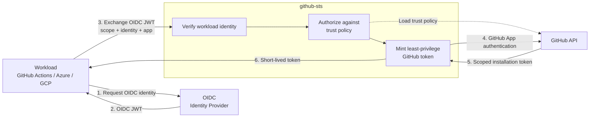

Exchange OIDC tokens for short-lived, scoped GitHub installation tokens. No PATs. No long-lived secrets.

Workloads with OIDC tokens (GitHub Actions, Azure, GCP, any IdP) present their identity and receive a **least-privilege GitHub token** scoped to exactly the repositories and permissions they need. Supports **multiple GitHub Apps** with YAML-based configuration, making it ideal for Kubernetes ConfigMaps.

Inspired by [octo-sts/app](https://github.com/octo-sts/app), which pioneered OIDC federation for GitHub token exchange.

## Highlights

| | Feature | Description |
|---|---|---|
| **Zero-trust** | OIDC Federation | No stored credentials: identity verified via OIDC JWT validation |
| **Least-privilege** | Policy-based Scoping | YAML trust policies define exact permissions per workload identity |
| **Multi-app** | Multiple GitHub Apps | Route different workloads through different GitHub Apps |
| **Org-scope** | Organization Tokens | Issue tokens scoped to an entire org or a subset of repositories |
| **Observable** | Prometheus Metrics | Built-in metrics and structured audit logging |
| **Replay-safe** | JTI Cache | Memory or Redis-backed JTI tracking prevents token replay attacks |
| **Portable** | Distroless Container | Single static binary in a minimal container: runs anywhere |

## Architecture



**OIDC proves who the workload is → policy determines what it may do → GitHub issues the credential.**

## Choose your path


  
  
  


## Quick start

```bash
# 1. Configure credentials
export GITHUBSTS_APP_DEFAULT_APP_ID="123456"
export GITHUBSTS_APP_DEFAULT_PRIVATE_KEY="$(cat /path/to/private-key.pem)"

# 2. Run the server
go build -o github-sts ./cmd/github-sts
./github-sts

# 3. Exchange a token
curl -H "Authorization: Bearer $OIDC_TOKEN" \
  "http://localhost:8080/sts/exchange?scope=org/repo&app=default&identity=ci"
```

See the complete [Getting Started](learn/getting-started) guide for prerequisites, policy creation, and verification.
