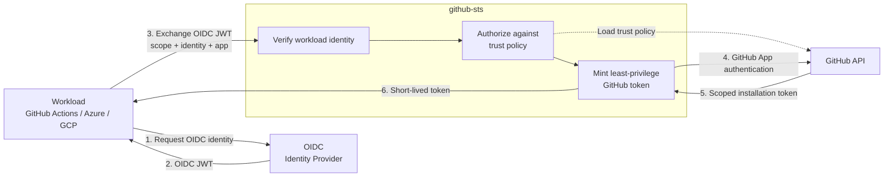
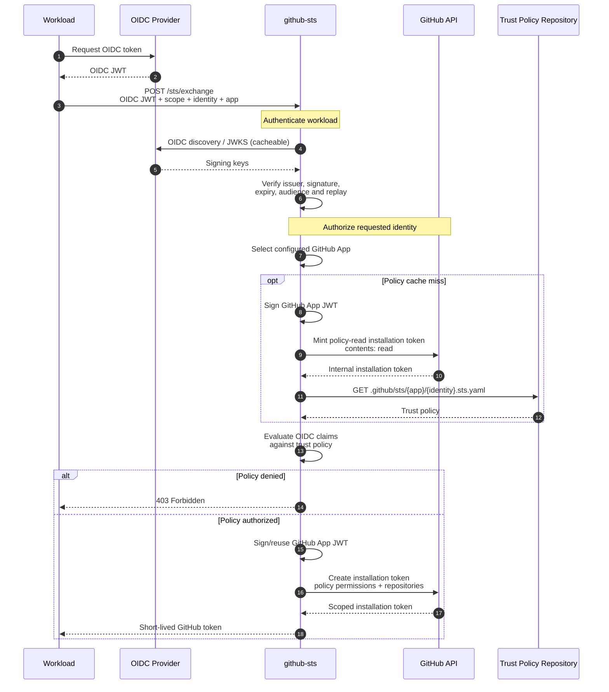
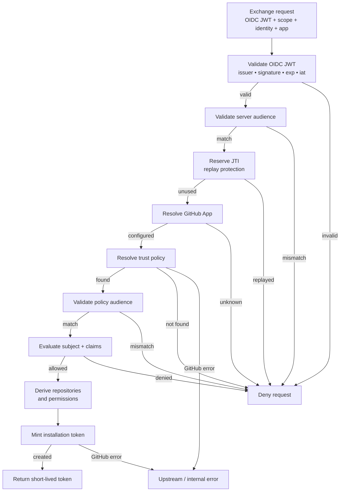
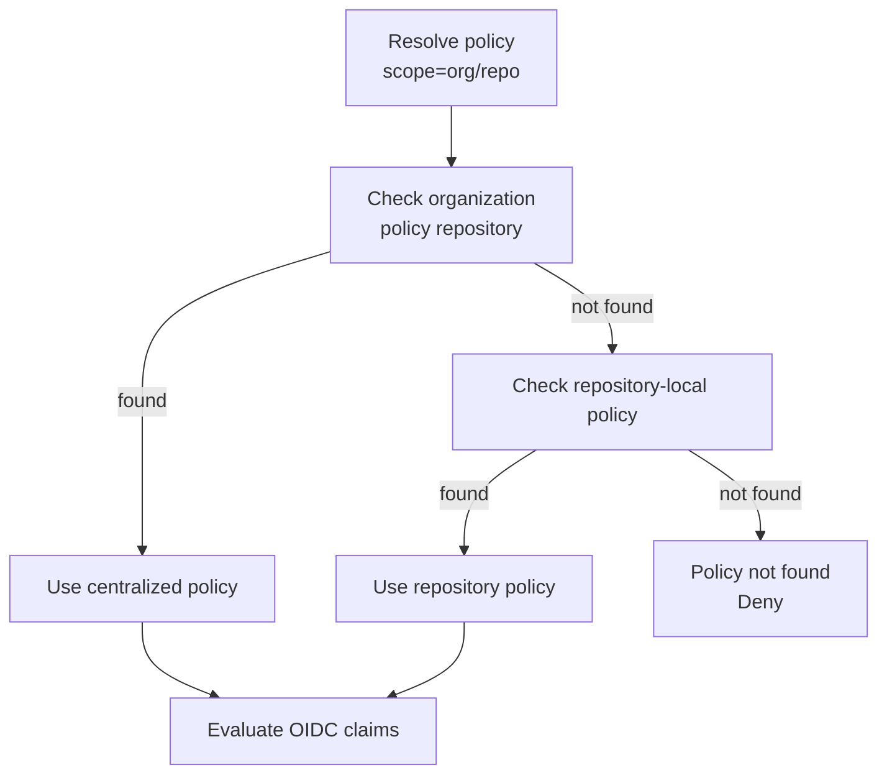

## Security model



**OIDC proves who the workload is → policy determines what it may do → GitHub issues the credential.**

The workload's OIDC token never becomes a GitHub credential. github-sts validates the OIDC identity, authorizes it against a trust policy, then uses its own GitHub App authority to mint a new, independent installation token.

## Token exchange

The full exchange involves two separate GitHub token mints: one to read the trust policy, and one to issue the workload token.



### Credential boundaries

Five distinct credentials exist during an exchange, each with a different holder and purpose:

| Credential | Holder | Purpose |
|---|---|---|
| **OIDC JWT** | Workload → github-sts | Prove workload identity |
| **GitHub App private key** | github-sts only | Sign App JWT (never leaves STS) |
| **GitHub App JWT** | github-sts → GitHub API | Authenticate the GitHub App |
| **Policy-read installation token** | github-sts → GitHub API | Read `.sts.yaml` (contents:read) |
| **Workload installation token** | github-sts → Workload | Authorized GitHub access |

github-sts signs the App JWT using the private key, uses it to authenticate to GitHub, and mints installation tokens. The workload never receives the App JWT, the private key, or the policy-read token.

## Authorization pipeline

Every request passes through these checks, in order. A failure at any step stops the pipeline and returns a `403` with a specific error `code`.



| Step | Check | Error code on failure |
|---|---|---|
| 1 | Parse the JWT and require an `iss` claim | `oidc_invalid` |
| 2 | Issuer allowlist: `iss` in `oidc.allowed_issuers` | `oidc_invalid` |
| 3 | JWKS fetch: retrieve keys from the issuer's pinned `jwks_uri` | `oidc_invalid` |
| 4 | Signature and claims: `kid` matches a JWKS key, RS256 signature valid, `exp` and `iat` required (`nbf` checked when present) | `oidc_invalid` |
| 5 | Server-wide audience: `aud` matches `oidc.required_audience` (if set) | `audience_mismatch` |
| 6 | JTI replay: `jti` not consumed within the `jti.ttl` window | `replay_detected` |
| 7 | App resolution: `?app=` matches a configured app | `app_unknown` |
| 8 | Policy lookup: `.sts.yaml` file found in repo or org policy repo | `policy_not_found` |
| 9 | Policy audience: token `aud` matches policy `audience:` | `audience_mismatch` |
| 10 | Claim evaluation: `subject`/`subject_pattern` and `claim_pattern` match | `policy_denied` |
| 11 | Token mint: GitHub API creates installation token | `upstream_error` |

See [API Reference]() for the full error code reference.

## Policy resolution

For repo-level scope (`scope=org/repo`), policies can live in two places:

- **Repo-local:** `org/repo/.github/sts/{app}/{identity}.sts.yaml`
- **Org-level:** `org/{org_policy_repo}/.github/sts/{app}/{identity}.sts.yaml`

The `policy_resolution` setting per app decides which wins on collision:



The diagram shows `org_first` (default). Other modes:

| Mode | Order | On collision |
|---|---|---|
| `org_first` *(default)* | org → repo fallback | **org wins** |
| `repo_first` *(deprecated)* | repo → org fallback | repo wins |
| `org_only` | org repo only, no fallback | n/a |

If `org_policy_repo` is unset, only the requesting repo is consulted regardless of mode.

## Project structure

```
cmd/github-sts/           Entry point — server bootstrap, signal handling
client/                   Importable Go client library (token exchange + revocation)
internal/
  config/                 YAML + env var configuration
  audit/                  Channel-based async audit logger
  handler/                HTTP handlers (exchange, health, readiness)
  server/                 HTTP server lifecycle, middleware, graceful shutdown
  metrics/                Prometheus metrics registry
  oidc/                   OIDC JWT validation with JWKS caching
  policy/                 Trust policy loading & claim evaluation
  jti/                    JTI replay cache (in-memory + Redis)
  ratelimit/              Per-identity rate limiting
  github/                 GitHub App auth, installation token provider
config/examples/          Ready-to-use trust policy templates
```

## Caching

| Cache | Default TTL | Setting | Purpose |
|---|---|---|---|
| JWKS keys | `1h` | — | Avoid fetching JWKS on every request |
| Trust policy | `60s` | `GITHUBSTS_POLICY_CACHE_TTL` | Avoid re-fetching `.sts.yaml` from GitHub on every request |
| GitHub App installation ID | `15m` | — | Avoid re-discovering the installation on every request |
| JTI replay set | `1h` | `GITHUBSTS_JTI_TTL` | Replay window. Use `redis` backend for multi-replica deployments. |

Installation tokens themselves are not cached; each exchange mints a fresh token.

## Multi-replica considerations

- Use `GITHUBSTS_JTI_BACKEND=redis` so JTI replay protection is shared across instances. With `memory`, an attacker who reaches a different replica can replay an OIDC token.
- Trust policy cache is per-instance; instances may briefly serve different policies after a `.sts.yaml` change. Lower `GITHUBSTS_POLICY_CACHE_TTL` if this matters.
- `/ready` returns `503` with `{"ready":false}` while the server is not yet serving and `200` with `{"ready":true}` once it is; use it for load balancer health checks.
