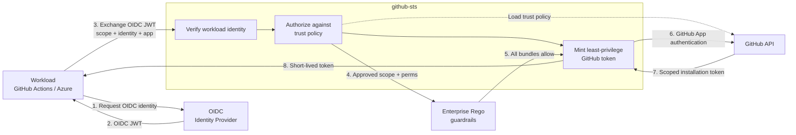
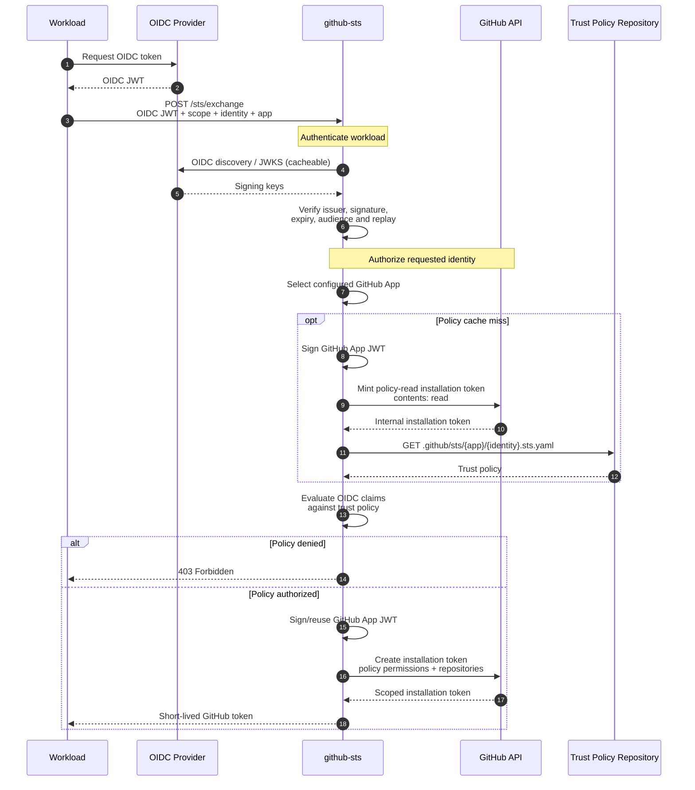
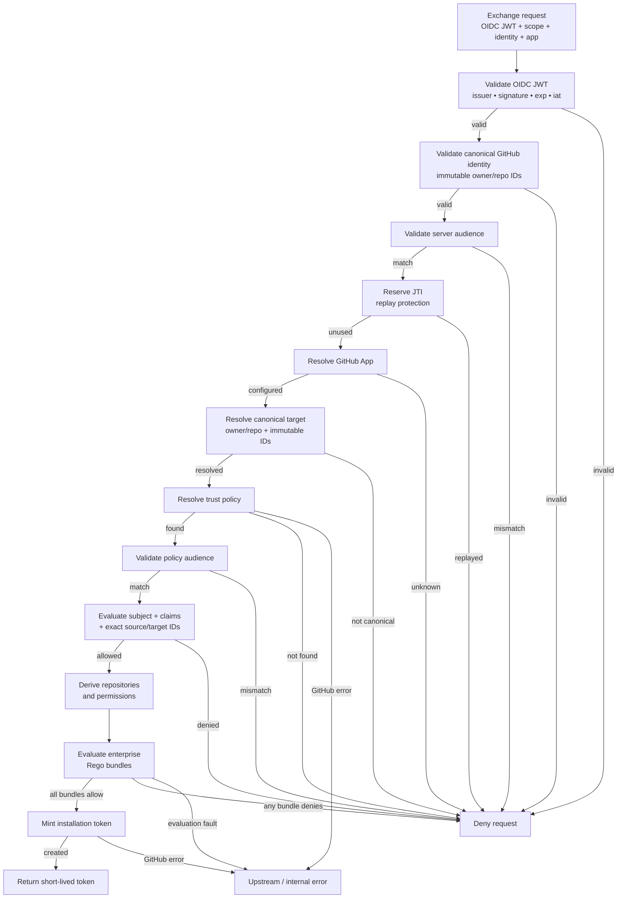
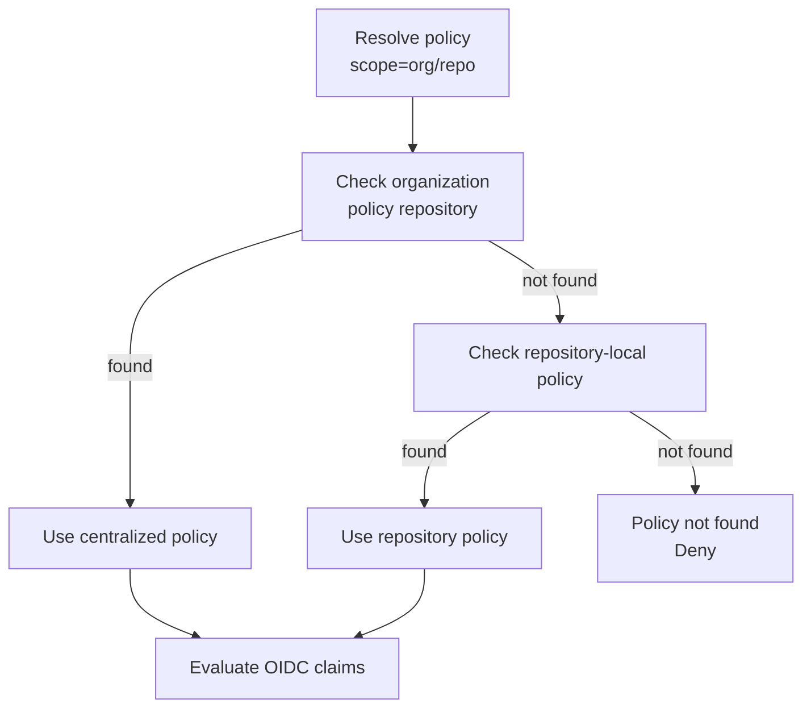
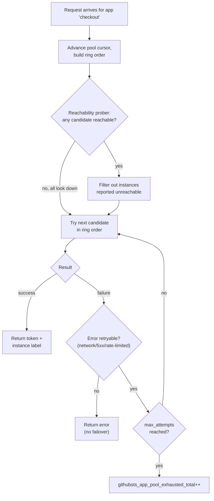

## Security model



**OIDC proves who the workload is → policy determines what it may do → GitHub issues the credential.**

The workload's OIDC token never becomes a GitHub credential. github-sts validates the OIDC identity, authorizes it against a trust policy, then uses its own GitHub App authority to mint a new, independent installation token.

## Token exchange

The full exchange involves two separate GitHub token mints: one to read the trust policy, and one to issue the workload token.



### Credential boundaries

Five distinct credentials exist during an exchange, each with a different holder and purpose:

| Credential | Holder | Purpose |
|---|---|---|
| **OIDC JWT** | Workload → github-sts | Prove workload identity |
| **GitHub App private key** | github-sts only | Sign App JWT (never leaves STS) |
| **GitHub App JWT** | github-sts → GitHub API | Authenticate the GitHub App |
| **Policy-read installation token** | github-sts → GitHub API | Read `.sts.yaml` (contents:read) |
| **Workload installation token** | github-sts → Workload | Authorized GitHub access |

github-sts signs the App JWT using the private key, uses it to authenticate to GitHub, and mints installation tokens. The workload never receives the App JWT, the private key, or the policy-read token.

## Authorization pipeline

Every request passes through these checks, in order. A failure at any step stops the pipeline and returns a `403` with a specific error `code`.



| Step | Check | Error code on failure |
|---|---|---|
| 1 | Parse the JWT and require an `iss` claim | `oidc_invalid` |
| 2 | Issuer allowlist: `iss` in `oidc.allowed_issuers` | `oidc_invalid` |
| 3 | JWKS fetch: retrieve keys from the issuer's pinned `jwks_uri` | `oidc_invalid` |
| 4 | Signature and claims: `kid` matches a JWKS key, RS256 signature valid, `exp` and `iat` required (`nbf` checked when present) | `oidc_invalid` |
| 5 | Canonical GitHub identity: for GitHub.com, cross-check signed owner/repository ID claims and require immutable `sub` format by default | `github_identity_invalid` |
| 6 | Server-wide audience: `aud` matches `oidc.required_audience` (if set) | `audience_mismatch` |
| 7 | JTI replay: `jti` not consumed within the `jti.ttl` window | `replay_detected` |
| 8 | App resolution: `?app=` matches a configured app | `app_unknown` |
| 9 | Target resolution: resolve `scope` to GitHub's current canonical owner/repository names and immutable IDs; organization-level scopes are rejected | `bad_request` |
| 10 | Policy lookup: `.sts.yaml` file found in repo or org policy repo, keyed by target IDs | `policy_not_found` |
| 11 | Policy validation: workload selector, GitHub ID bindings, and `audience:` are present and well-formed | `trust_policy_invalid` |
| 12 | Policy audience: token `aud` matches policy `audience:` | `audience_mismatch` |
| 13 | Claim and relationship evaluation: `subject`/`subject_pattern`, `claim_pattern`, and exact immutable `github.sources[]`/`github.target` IDs match | `policy_denied` |
| 14 | Enterprise Rego enforcement: required mode proves mandatory baseline participation, then composes all applicable app-scoped bundles additively | `org_policy_denied`, `bundle_stale`, `bundle_unavailable`, `bundle_evaluation_failed` |
| 15 | Token mint: GitHub API creates an installation token scoped to the authorized `repository_id` | `upstream_error` |

See [API Reference]() for the full error code reference.

## Bundle admission and participation

Startup requires top-level `bundle_enforcement` to be exactly `required` or
`optional`. Required mode admits exactly one global `apps: []` baseline, and
every required-mode bundle must be digest-pinned OCI and cosign verified. The
global baseline is fail-closed and must expose
`data.sts.enterprise.v1.decision` plus `data.sts.enterprise.v1.metadata` with
the v1 contract metadata. The broker requires that baseline to deny malformed
input, missing identity, unknown source, and unknown permission probes before
installation.

At request time, the global baseline applies to every app. App-scoped bundles
can add denials but cannot replace the baseline. Required mode returns
`bundle_unavailable` unless the baseline actually evaluates. Optional mode
with no bundles is deliberately YAML-only and reports that posture through
startup warning, health, metric, and audit signals.

## Policy resolution

For repo-level scope (`scope=org/repo`), policies can live in two places:

- **Repo-local:** `org/repo/.github/sts/{app}/{identity}.sts.yaml`
- **Org-level:** `org/{org_policy_repo}/.github/sts/{app}/{identity}.sts.yaml`

The `policy_resolution` setting per app decides which wins on collision:



The diagram shows `org_first` (default). Other modes:

| Mode | Order | On collision |
|---|---|---|
| `org_first` *(default)* | org → repo fallback | **org wins** |
| `repo_first` *(deprecated)* | repo → org fallback | repo wins |
| `org_only` | org repo only, no fallback | n/a |

If `org_policy_repo` is unset, only the requesting repo is consulted regardless of mode.

## Project structure

```
cmd/github-sts/           Entry point: server bootstrap, signal handling
client/                   Importable Go client library (token exchange + revocation)
internal/
  config/                 YAML + env var configuration
  audit/                  Channel-based async audit logger
  handler/                HTTP handlers (exchange, health, readiness)
  server/                 HTTP server lifecycle, middleware, graceful shutdown
  metrics/                Prometheus metrics registry
  oidc/                   OIDC JWT validation with JWKS caching
  policy/                 Trust policy loading & claim evaluation
  bundle/                 OPA bundle loading, verification, evaluation, and lifecycle
  jti/                    JTI replay cache (in-memory + Redis)
  ratelimit/              Per-identity rate limiting
  github/                 GitHub App auth, installation token provider
config/examples/          Ready-to-use trust policy templates
```

## Caching

| Cache | Default TTL | Setting | Purpose |
|---|---|---|---|
| JWKS keys | `1h` | n/a | Avoid fetching JWKS on every request |
| Target identity | `5m` | n/a | Bound GitHub metadata lookups while refreshing canonical names and immutable IDs |
| Trust policy | `60s` | `GITHUBSTS_POLICY_CACHE_TTL` | Avoid re-fetching `.sts.yaml`; repository targets are isolated by immutable IDs |
| GitHub App installation ID | `15m` | n/a | Avoid re-discovering the installation on every request |
| JTI replay set | `1h` | `GITHUBSTS_JTI_TTL` | Replay window. Use `redis` backend for multi-replica deployments. |

Installation tokens themselves are not cached; each exchange mints a fresh token.

## App pools and failover

A logical app name can be backed by a pool of several physical GitHub Apps (`apps.<name>.instances`) instead of one, so the effective GitHub primary rate-limit ceiling for that app scales with the number of instances. See [Configuration]() for the schema. A single-instance app is, internally, a pool of one: every app goes through the same selection path, so there is no separate code path to fall out of sync.

An "instance" here is one physical GitHub App inside one logical app's pool, not a github-sts server replica. The two are unrelated: a pool exists independently of how many github-sts replicas are running, and each replica selects across the same configured pool. See [Multi-replica considerations](#multi-replica-considerations) below for the replica concept.



Per request, `AppPool`:

1. Advances a shared cursor and builds a ring starting from it, so a request's own retries walk consecutive members instead of re-randomizing.
2. Drops any candidate the reachability prober currently reports unreachable, unless that would drop every candidate, in which case it tries the unfiltered ring anyway. A live failure is authoritative; a locally-cached "probably down" is not.
3. Tries candidates in order. On success, returns the token and the serving instance's label. On a retryable failure (network/timeout, 5xx, or a 403 carrying a rate-limit signal), it moves to the next candidate, up to `rotation.max_attempts`. On a non-retryable failure (422 permission/repository mismatch, or any other unclassified error), it returns immediately: a different credential cannot fix a permissions problem.
4. If every tried candidate fails, the request fails and `githubsts_app_pool_exhausted_total` increments. That's the metric worth alerting on, since any single instance's rate-limit gauge dropping doesn't by itself mean requests are failing.

Callers never see which instance served a request; it appears only in the `instance` label on metrics and in the audit log (empty on a failed exchange, since naming one arbitrarily-tried instance out of several that all failed would misleadingly suggest it was uniquely at fault).

The default `rotation.strategy` is `round_robin`, not a rate-limit-aware ranking, deliberately: with R replicas sharing one pool, any single replica's view of an instance's remaining rate limit reflects only the roughly `1/R` slice of traffic it personally routed there, and that blind spot gets worse, not better, as replica count grows. The baseline reachability filter above doesn't have this problem: each replica derives it from its own periodic probe against GitHub's API, not from request traffic, so it stays accurate regardless of replica count. `rate_limit_aware` is accepted as a config value but not yet implemented (github-sts logs a startup warning if it's set); a pool configured with it currently behaves exactly like `round_robin`.

## Multi-replica considerations

- Use `GITHUBSTS_JTI_BACKEND=redis` so JTI replay protection is shared across instances. With `memory`, an attacker who reaches a different replica can replay an OIDC token.
- Trust policy cache is per-instance; instances may briefly serve different policies after a `.sts.yaml` change. Lower `GITHUBSTS_POLICY_CACHE_TTL` if this matters.
- `/ready` returns `503` with `{"ready":false}` while the server is not yet serving and `200` with `{"ready":true}` once it is; use it for load balancer health checks.
- App pool reachability state (used for the baseline liveness filter above) is also per-replica, but unlike the rate-limit-aware strategy, this isn't a meaningful blind spot; see the reasoning above.
