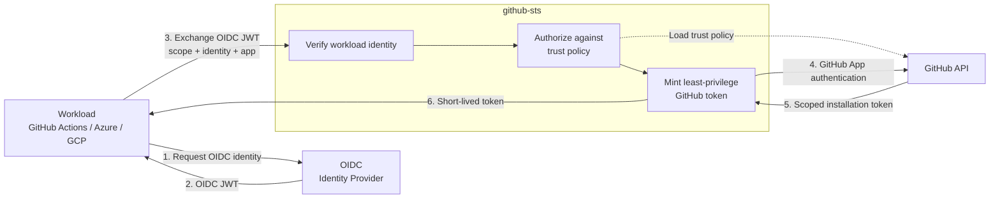

Échangez des jetons OIDC pour des jetons d'installation GitHub temporaires et limités. Sans PAT. Sans secrets persistants.

Les charges de travail avec des jetons OIDC (GitHub Actions, Azure, GCP, n'importe quel IdP) présentent leur identité et reçoivent un **jeton GitHub à privilège minimal** limité exactement aux dépôts et autorisations dont elles ont besoin. Prend en charge **plusieurs GitHub Apps** avec une configuration YAML, idéal pour les ConfigMaps Kubernetes.

Inspiré par [octo-sts/app](https://github.com/octo-sts/app), pionnier de la fédération OIDC pour l'échange de jetons GitHub.

## Points forts

| | Fonctionnalité | Description |
|---|---|---|
| **Zero-trust** | Fédération OIDC | Aucune donnée d'identification stockée: identité vérifiée par validation JWT OIDC |
| **Privilège minimal** | Portée basée sur les politiques | Les politiques de confiance YAML définissent des autorisations exactes par identité de charge de travail |
| **Multi-app** | Plusieurs GitHub Apps | Aiguiller différentes charges de travail via différentes GitHub Apps |
| **Portée d'organisation** | Jetons d'organisation | Émettre des jetons limités à une organisation entière ou à un sous-ensemble de dépôts |
| **Observable** | Métriques Prometheus | Métriques intégrées et journalisation d'audit structurée |
| **Anti-rejeu** | Cache JTI | Suivi JTI en mémoire ou Redis pour empêcher les attaques par rejeu de jetons |
| **Portable** | Conteneur Distroless | Binaire statique unique dans un conteneur minimal: fonctionne partout |

## Architecture



**OIDC prouve qui est la charge de travail → la politique détermine ce qu'elle peut faire → GitHub émet le crédentiel.**

## Choisissez votre parcours


  
  
  


## Démarrage rapide

```bash
# 1. Configure credentials
export GITHUBSTS_APP_DEFAULT_APP_ID="123456"
export GITHUBSTS_APP_DEFAULT_PRIVATE_KEY="$(cat /path/to/private-key.pem)"

# 2. Run the server
go build -o github-sts ./cmd/github-sts
./github-sts

# 3. Exchange a token
curl -H "Authorization: Bearer $OIDC_TOKEN" \
  "http://localhost:8080/sts/exchange?scope=org/repo&app=default&identity=ci"
```

Consultez le guide complet [Démarrage rapide](learn/getting-started) pour les prérequis, la création de politique et la vérification.
