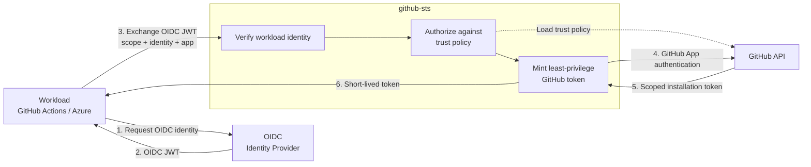
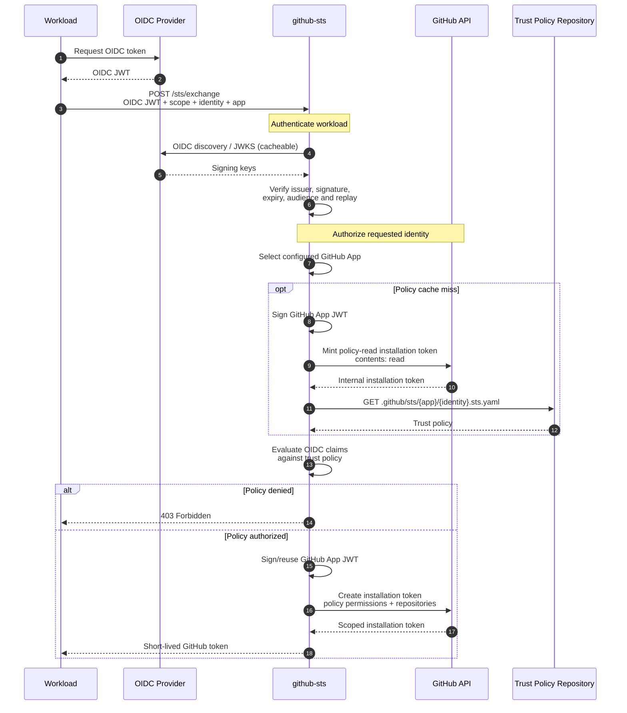
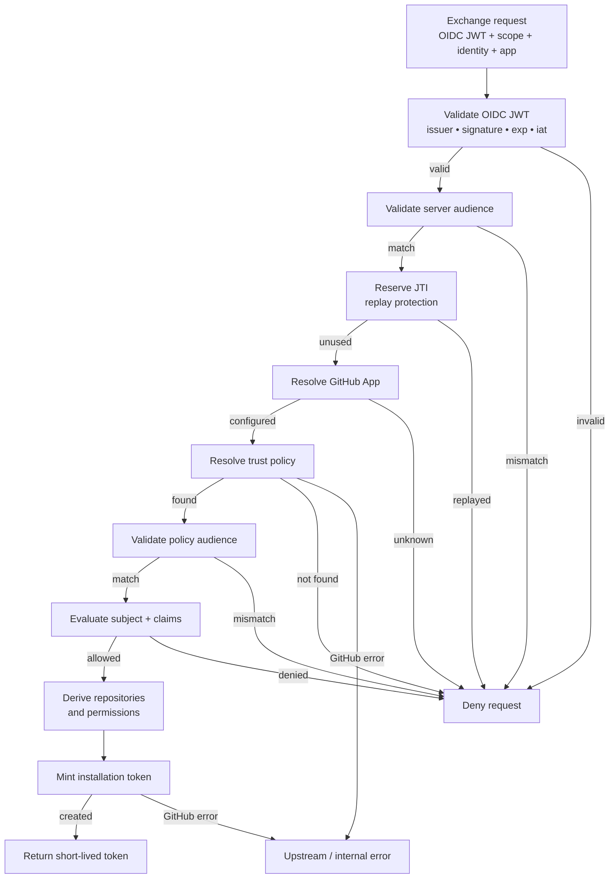
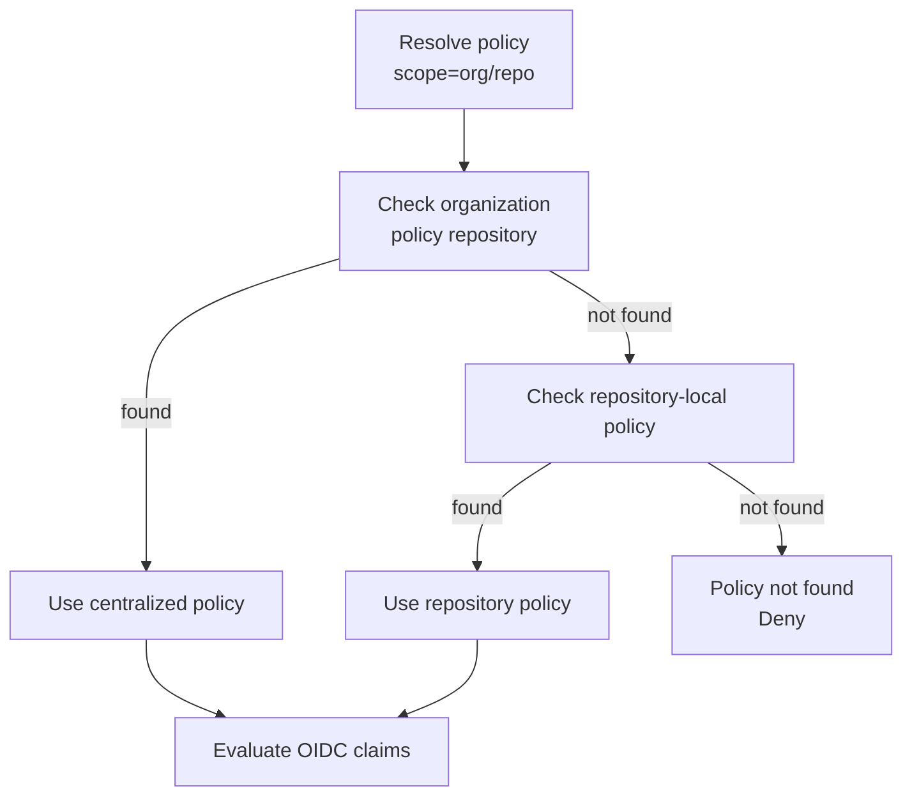

## Modèle de sécurité



**OIDC prouve qui est la charge de travail → la politique détermine ce qu'elle peut faire → GitHub émet le crédentiel.**

Le jeton OIDC de la charge de travail ne devient jamais un crédentiel GitHub. github-sts valide l'identité OIDC, l'autorise par rapport à une politique de confiance, puis utilise sa propre autorité de GitHub App pour émettre un nouveau jeton d'installation indépendant.

## Échange de jeton

L'échange complet implique deux émissions de jetons GitHub distinctes : une pour lire la politique de confiance, et une pour émettre le jeton de la charge de travail.



### Limites de crédentiels

Cinq crédentiels distincts existent au cours d'un échange, chacun avec un détenteur et un objectif différents :

| Crédentiel | Détenteur | Objectif |
|---|---|---|
| **Jeton OIDC** | Charge de travail → github-sts | Prouver l'identité de la charge de travail |
| **Clé privée de la GitHub App** | github-sts uniquement | Signer le JWT d'App (ne quitte jamais le STS) |
| **JWT de la GitHub App** | github-sts → API GitHub | Authentifier la GitHub App |
| **Jeton d'installation de lecture de politique** | github-sts → API GitHub | Lire `.sts.yaml` (contents:read) |
| **Jeton d'installation de charge de travail** | github-sts → Charge de travail | Accès GitHub autorisé |

github-sts signe le JWT d'App à l'aide de la clé privée, l'utilise pour s'authentifier auprès de GitHub, puis émet des jetons d'installation. La charge de travail ne reçoit jamais le JWT d'App, la clé privée, ni le jeton de lecture de politique.

## Pipeline d'autorisation {#authorization-pipeline}

Chaque requête passe par ces vérifications, dans l'ordre. Un échec à n'importe quelle étape arrête le pipeline et renvoie un `403` avec un `code` d'erreur spécifique.



| Étape | Vérification | Code d'erreur en cas d'échec |
|---|---|---|
| 1 | Analyser le JWT et exiger une revendication `iss` | `oidc_invalid` |
| 2 | Liste d'autorisation d'émetteurs : `iss` dans `oidc.allowed_issuers` | `oidc_invalid` |
| 3 | Récupération JWKS : récupérer les clés depuis le `jwks_uri` épinglé de l'émetteur | `oidc_invalid` |
| 4 | Signature et revendications : `kid` correspond à une clé JWKS, signature RS256 valide, `exp` et `iat` requises (`nbf` vérifié lorsqu'il est présent) | `oidc_invalid` |
| 5 | Audience au niveau du serveur : `aud` correspond à `oidc.required_audience` (si défini) | `audience_mismatch` |
| 6 | Rejeu JTI : `jti` non consommé dans la fenêtre `jti.ttl` | `replay_detected` |
| 7 | Résolution d'App : `?app=` correspond à une App configurée | `app_unknown` |
| 8 | Recherche de politique : fichier `.sts.yaml` trouvé dans le dépôt ou le dépôt de politiques d'organisation | `policy_not_found` |
| 9 | Audience de politique : `aud` du jeton correspond à `audience:` de la politique | `audience_mismatch` |
| 10 | Évaluation des revendications : `subject`/`subject_pattern` et `claim_pattern` correspondent | `policy_denied` |
| 11 | Émission de jeton : l'API GitHub crée le jeton d'installation | `upstream_error` |

Consultez la [Référence API]() pour la référence complète des codes d'erreur.

## Résolution de politique

Pour la portée de dépôt (`scope=org/repo`), les politiques peuvent se trouver à deux endroits :

- **Locale au dépôt :** `org/repo/.github/sts/{app}/{identity}.sts.yaml`
- **Niveau organisation :** `org/{org_policy_repo}/.github/sts/{app}/{identity}.sts.yaml`

Le paramètre `policy_resolution` par App détermine lequel l'emporte en cas de collision :



Le diagramme illustre `org_first` (par défaut). Autres modes :

| Mode | Ordre | En cas de collision |
|---|---|---|
| `org_first` *(par défaut)* | org → repli dépôt | **l'organisation l'emporte** |
| `repo_first` *(obsolète)* | dépôt → repli org | le dépôt l'emporte |
| `org_only` | dépôt d'organisation uniquement, sans repli | n/a |

Si `org_policy_repo` n'est pas défini, seul le dépôt demandeur est consulté, quel que soit le mode.

## Structure du projet

```
cmd/github-sts/           Point d'entrée — démarrage du serveur, gestion des signaux
client/                   Bibliothèque cliente Go importable (échange de jeton + révocation)
internal/
  config/                 Configuration YAML + variables d'environnement
  audit/                  Journal d'audit asynchrone par canal
  handler/                Gestionnaires HTTP (exchange, health, readiness)
  server/                 Cycle de vie du serveur HTTP, middleware, arrêt gracieux
  metrics/                Registre de métriques Prometheus
  oidc/                   Validation JWT OIDC avec cache JWKS
  policy/                 Chargement des politiques de confiance et évaluation des revendications
  jti/                    Cache de rejeu JTI (en mémoire + Redis)
  ratelimit/              Limitation de débit par identité
  github/                 Authentification GitHub App, fournisseur de jetons d'installation
config/examples/          Modèles de politiques de confiance prêts à l'emploi
```

## Mise en cache

| Cache | TTL par défaut | Paramètre | Objectif |
|---|---|---|---|
| Clés JWKS | `1h` | — | Éviter de récupérer le JWKS à chaque requête |
| Politique de confiance | `60s` | `GITHUBSTS_POLICY_CACHE_TTL` | Éviter de récupérer `.sts.yaml` depuis GitHub à chaque requête |
| ID d'installation de la GitHub App | `15m` | — | Éviter de redécouvrir l'installation à chaque requête |
| Ensemble de rejeu JTI | `1h` | `GITHUBSTS_JTI_TTL` | Fenêtre de rejeu. Utilisez le backend `redis` pour les déploiements multi-réplicas. |

Les jetons d'installation eux-mêmes ne sont pas mis en cache ; chaque échange émet un nouveau jeton.

## Considérations multi-réplicas

- Utilisez `GITHUBSTS_JTI_BACKEND=redis` pour que la protection contre le rejeu JTI soit partagée entre les instances. Avec `memory`, un attaquant qui atteint un autre réplica peut rejouer un jeton OIDC.
- Le cache des politiques de confiance est par instance ; les instances peuvent brièvement servir des politiques différentes après une modification de `.sts.yaml`. Réduisez `GITHUBSTS_POLICY_CACHE_TTL` si cela est important.
- `/ready` renvoie `503` avec `{"ready":false}` tant que le serveur n'est pas en service et `200` avec `{"ready":true}` une fois qu'il l'est ; utilisez-le pour les vérifications de santé des équilibreurs de charge.
