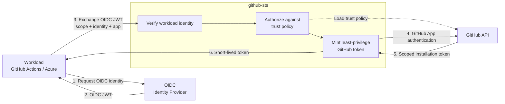
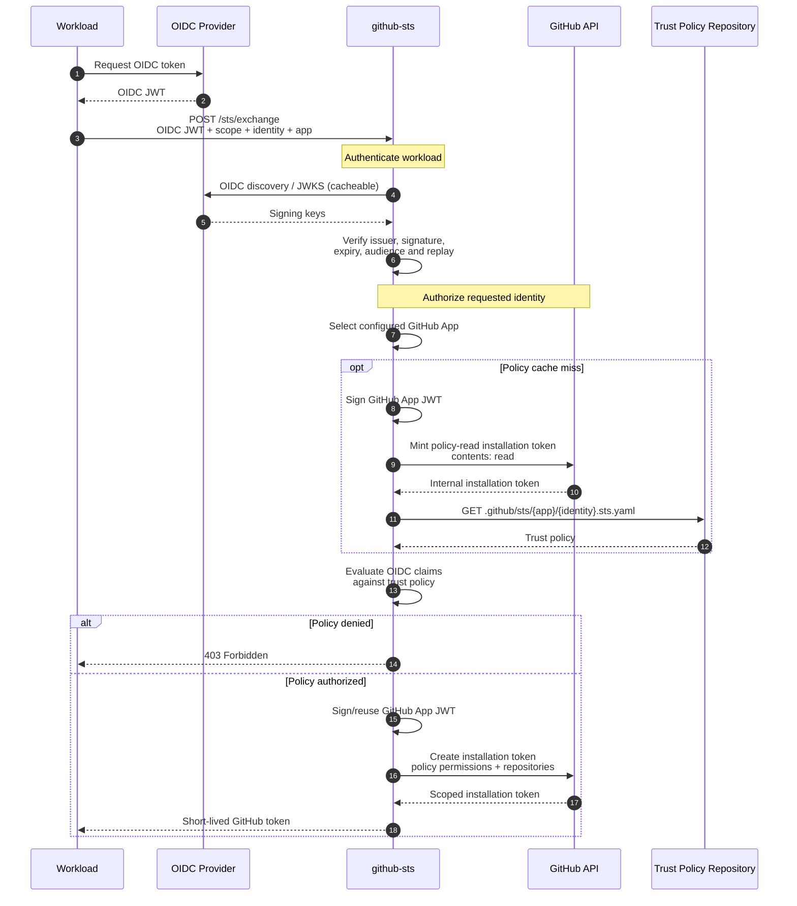
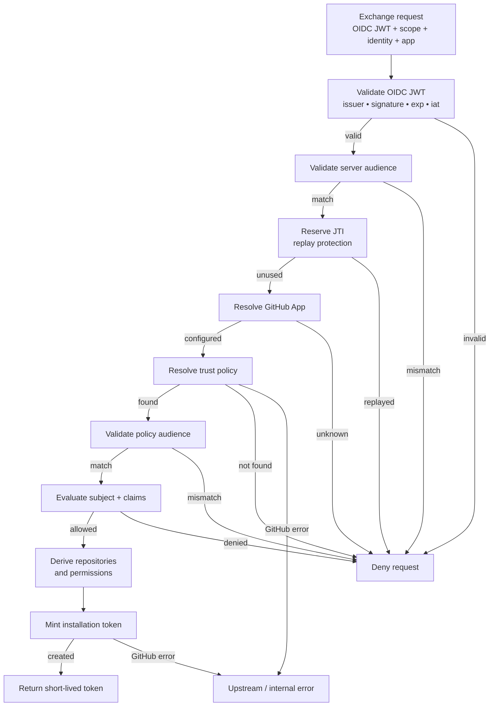
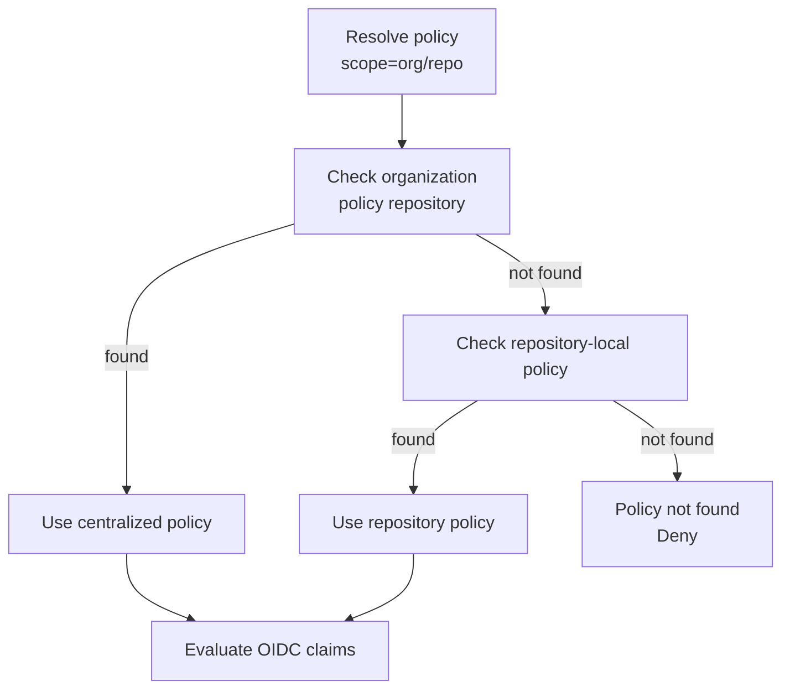
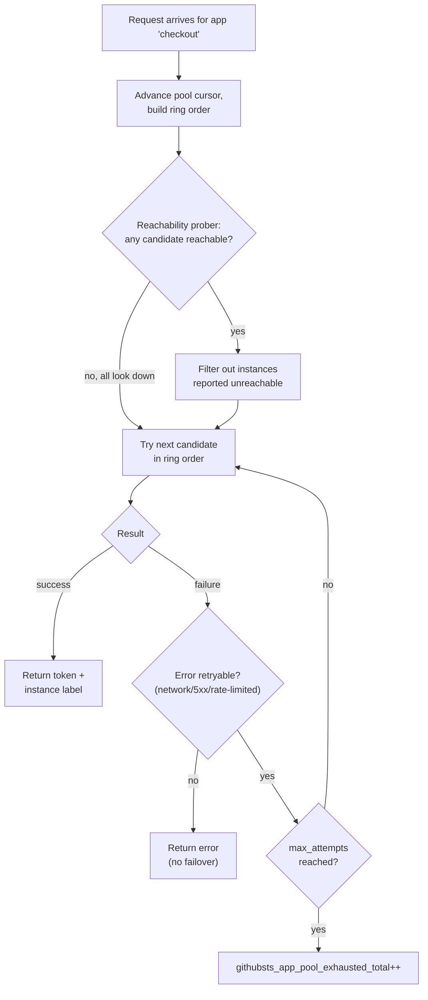

## Modèle de sécurité



**OIDC prouve qui est la charge de travail → la politique détermine ce qu'elle peut faire → GitHub émet le crédentiel.**

Le jeton OIDC de la charge de travail ne devient jamais un crédentiel GitHub. github-sts valide l'identité OIDC, l'autorise par rapport à une politique de confiance, puis utilise sa propre autorité de GitHub App pour émettre un nouveau jeton d'installation indépendant.

## Échange de jeton

L'échange complet implique deux émissions de jetons GitHub distinctes : une pour lire la politique de confiance, et une pour émettre le jeton de la charge de travail.



### Limites de crédentiels

Cinq crédentiels distincts existent au cours d'un échange, chacun avec un détenteur et un objectif différents :

| Crédentiel | Détenteur | Objectif |
|---|---|---|
| **Jeton OIDC** | Charge de travail → github-sts | Prouver l'identité de la charge de travail |
| **Clé privée de la GitHub App** | github-sts uniquement | Signer le JWT d'App (ne quitte jamais le STS) |
| **JWT de la GitHub App** | github-sts → API GitHub | Authentifier la GitHub App |
| **Jeton d'installation de lecture de politique** | github-sts → API GitHub | Lire `.sts.yaml` (contents:read) |
| **Jeton d'installation de charge de travail** | github-sts → Charge de travail | Accès GitHub autorisé |

github-sts signe le JWT d'App à l'aide de la clé privée, l'utilise pour s'authentifier auprès de GitHub, puis émet des jetons d'installation. La charge de travail ne reçoit jamais le JWT d'App, la clé privée, ni le jeton de lecture de politique.

## Pipeline d'autorisation {#authorization-pipeline}

Chaque requête passe par ces vérifications, dans l'ordre. Un échec à n'importe quelle étape arrête le pipeline et renvoie un `403` avec un `code` d'erreur spécifique.



| Étape | Vérification | Code d'erreur en cas d'échec |
|---|---|---|
| 1 | Analyser le JWT et exiger une revendication `iss` | `oidc_invalid` |
| 2 | Liste d'autorisation d'émetteurs : `iss` dans `oidc.allowed_issuers` | `oidc_invalid` |
| 3 | Récupération JWKS : récupérer les clés depuis le `jwks_uri` épinglé de l'émetteur | `oidc_invalid` |
| 4 | Signature et revendications : `kid` correspond à une clé JWKS, signature RS256 valide, `exp` et `iat` requises (`nbf` vérifié lorsqu'il est présent) | `oidc_invalid` |
| 5 | Audience au niveau du serveur : `aud` correspond à `oidc.required_audience` (si défini) | `audience_mismatch` |
| 6 | Rejeu JTI : `jti` non consommé dans la fenêtre `jti.ttl` | `replay_detected` |
| 7 | Résolution d'App : `?app=` correspond à une App configurée | `app_unknown` |
| 8 | Recherche de politique : fichier `.sts.yaml` trouvé dans le dépôt ou le dépôt de politiques d'organisation | `policy_not_found` |
| 9 | Audience de politique : `aud` du jeton correspond à `audience:` de la politique | `audience_mismatch` |
| 10 | Évaluation des revendications : `subject`/`subject_pattern` et `claim_pattern` correspondent | `policy_denied` |
| 11 | Émission de jeton : l'API GitHub crée le jeton d'installation | `upstream_error` |

Consultez la [Référence API]() pour la référence complète des codes d'erreur.

## Résolution de politique

Pour la portée de dépôt (`scope=org/repo`), les politiques peuvent se trouver à deux endroits :

- **Locale au dépôt :** `org/repo/.github/sts/{app}/{identity}.sts.yaml`
- **Niveau organisation :** `org/{org_policy_repo}/.github/sts/{app}/{identity}.sts.yaml`

Le paramètre `policy_resolution` par App détermine lequel l'emporte en cas de collision :



Le diagramme illustre `org_first` (par défaut). Autres modes :

| Mode | Ordre | En cas de collision |
|---|---|---|
| `org_first` *(par défaut)* | org → repli dépôt | **l'organisation l'emporte** |
| `repo_first` *(obsolète)* | dépôt → repli org | le dépôt l'emporte |
| `org_only` | dépôt d'organisation uniquement, sans repli | n/a |

Si `org_policy_repo` n'est pas défini, seul le dépôt demandeur est consulté, quel que soit le mode.

## Structure du projet

```
cmd/github-sts/           Point d'entrée — démarrage du serveur, gestion des signaux
client/                   Bibliothèque cliente Go importable (échange de jeton + révocation)
internal/
  config/                 Configuration YAML + variables d'environnement
  audit/                  Journal d'audit asynchrone par canal
  handler/                Gestionnaires HTTP (exchange, health, readiness)
  server/                 Cycle de vie du serveur HTTP, middleware, arrêt gracieux
  metrics/                Registre de métriques Prometheus
  oidc/                   Validation JWT OIDC avec cache JWKS
  policy/                 Chargement des politiques de confiance et évaluation des revendications
  jti/                    Cache de rejeu JTI (en mémoire + Redis)
  ratelimit/              Limitation de débit par identité
  github/                 Authentification GitHub App, fournisseur de jetons d'installation
config/examples/          Modèles de politiques de confiance prêts à l'emploi
```

## Mise en cache

| Cache | TTL par défaut | Paramètre | Objectif |
|---|---|---|---|
| Clés JWKS | `1h` | — | Éviter de récupérer le JWKS à chaque requête |
| Politique de confiance | `60s` | `GITHUBSTS_POLICY_CACHE_TTL` | Éviter de récupérer `.sts.yaml` depuis GitHub à chaque requête |
| ID d'installation de la GitHub App | `15m` | — | Éviter de redécouvrir l'installation à chaque requête |
| Ensemble de rejeu JTI | `1h` | `GITHUBSTS_JTI_TTL` | Fenêtre de rejeu. Utilisez le backend `redis` pour les déploiements multi-réplicas. |

Les jetons d'installation eux-mêmes ne sont pas mis en cache ; chaque échange émet un nouveau jeton.

## Pools d'Apps et basculement

Un nom d'App logique peut être adossé à un pool de plusieurs GitHub Apps physiques (`apps.<name>.instances`) plutôt qu'à une seule, de sorte que le plafond effectif de limite de débit primaire GitHub pour cette App augmente avec le nombre d'instances. Voir [Configuration]() pour le schéma. Une App à instance unique est, en interne, un pool d'une instance : toute App passe par le même chemin de sélection, donc il n'existe pas de chemin de code distinct susceptible de diverger.

Une « instance », ici, est une GitHub App physique au sein du pool d'une App logique, pas un réplica du serveur github-sts. Les deux notions sont indépendantes : un pool existe indépendamment du nombre de réplicas github-sts en cours d'exécution, et chaque réplica sélectionne dans le même pool configuré. Voir [Considérations multi-réplicas](#considérations-multi-réplicas) ci-dessous pour la notion de réplica.



Par requête, `AppPool` :

1. Avance un curseur partagé et construit un anneau à partir de celui-ci, de sorte que les propres tentatives d'une requête parcourent des membres consécutifs plutôt que de retirer au hasard.
2. Écarte toute instance actuellement signalée comme inaccessible par la sonde d'accessibilité, sauf si cela écarterait toutes les instances candidates, auquel cas il tente quand même l'anneau non filtré. Un échec en direct fait autorité ; un état local en cache « probablement en panne » n'en fait pas.
3. Tente les instances candidates dans l'ordre. En cas de succès, renvoie le jeton et l'étiquette de l'instance qui a servi. En cas d'échec réessayable (réseau/timeout, 5xx, ou un 403 portant un signal de limite de débit), il passe à l'instance candidate suivante, jusqu'à `rotation.max_attempts`. En cas d'échec non réessayable (422 pour incohérence d'autorisations/dépôts, ou toute autre erreur non classifiée), il renvoie immédiatement : un identifiant différent ne peut pas corriger un problème d'autorisations.
4. Si toutes les instances tentées échouent, la requête échoue et `githubsts_app_pool_exhausted_total` s'incrémente. C'est la métrique à surveiller par alerte, car la chute de la limite de débit d'une seule instance ne signifie pas en soi que des requêtes échouent.

Les appelants ne voient jamais quelle instance a servi une requête ; cela n'apparaît que dans l'étiquette `instance` des métriques et dans le journal d'audit (vide en cas d'échec de l'échange, car nommer une instance tentée arbitrairement parmi plusieurs ayant toutes échoué suggérerait à tort qu'elle est seule en cause).

La stratégie `rotation.strategy` par défaut est `round_robin`, et non un classement tenant compte de la limite de débit, délibérément : avec R réplicas partageant un même pool, la vue qu'a un seul réplica de la limite de débit restante d'une instance ne reflète qu'environ 1/R du trafic qu'il a lui-même routé vers elle, et cet angle mort s'aggrave, plutôt que de s'améliorer, à mesure que le nombre de réplicas augmente. Le filtre d'accessibilité de base ci-dessus n'a pas ce problème : chaque réplica le dérive de sa propre sonde périodique contre l'API GitHub, pas du trafic de requêtes, donc il reste fiable quel que soit le nombre de réplicas. `rate_limit_aware` est accepté comme valeur de configuration mais pas encore implémenté (github-sts journalise un avertissement au démarrage si elle est définie) ; un pool ainsi configuré se comporte actuellement exactement comme `round_robin`.

## Considérations multi-réplicas

- Utilisez `GITHUBSTS_JTI_BACKEND=redis` pour que la protection contre le rejeu JTI soit partagée entre les instances. Avec `memory`, un attaquant qui atteint un autre réplica peut rejouer un jeton OIDC.
- Le cache des politiques de confiance est par instance ; les instances peuvent brièvement servir des politiques différentes après une modification de `.sts.yaml`. Réduisez `GITHUBSTS_POLICY_CACHE_TTL` si cela est important.
- `/ready` renvoie `503` avec `{"ready":false}` tant que le serveur n'est pas en service et `200` avec `{"ready":true}` une fois qu'il l'est ; utilisez-le pour les vérifications de santé des équilibreurs de charge.
- L'état d'accessibilité du pool d'Apps (utilisé pour le filtre de base ci-dessus) est lui aussi par réplica, mais, contrairement à la stratégie tenant compte de la limite de débit, ce n'est pas un angle mort significatif ; voir le raisonnement ci-dessus.
